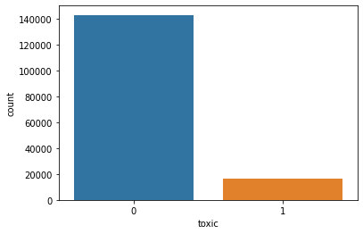

Привет, меня зовут Артем Хуршудов. Сегодня я проверю твой проект.
<br> Дальнейшее общение будет происходить на "ты" если это не вызывает никаких проблем.
<br> Желательно реагировать на каждый мой комментарий ('исправил', 'не понятно как исправить ошибку', ...)
<br> Пожалуйста, не удаляй комментарии ревьюера, так как они повышают качество повторного ревью.

Комментарии будут в <font color='green'>зеленой</font>, <font color='blue'>синей</font> или <font color='red'>красной</font> рамках:

<div class="alert alert-block alert-success">
<b>Успех:</b> Если все сделано отлично
</div>

<div class="alert alert-block alert-info">
<b>Совет: </b> Если можно немного улучшить
</div>

<div class="alert alert-block alert-danger">
<b>Ошибка:</b> Если требуются исправления. Работа не может быть принята с красными комментариями.
</div>

-------------------

Будет очень хорошо, если ты будешь помечать свои действия следующим образом:
<div class="alert alert-block alert-warning">
<b>Комментарий студента:</b> ...
</div>

<div class="alert alert-block alert-warning">
<b>Изменения:</b> Были внесены следующие изменения ...
</div>

<font color='green'><b>Полезные (и просто интересные) материалы:</b></font> \
Для работы с текстами используют и другие подходы. Например, сейчас активно используются RNN (LSTM) и трансформеры (BERT и другие с улицы Сезам, например, ELMO). НО! Они не являются панацеей, не всегда они нужны, так как и TF-IDF или Word2Vec + модели из классического ML тоже могут справляться. \
BERT тяжелый, существует много его вариаций для разных задач, есть готовые модели, есть надстройки над библиотекой transformers. Если, обучать BERT на GPU (можно в Google Colab или Kaggle), то должно быть побыстрее.\
https://huggingface.co/transformers/model_doc/bert.html \
https://t.me/renat_alimbekov \
https://colah.github.io/posts/2015-08-Understanding-LSTMs/ - Про LSTM \
https://web.stanford.edu/~jurafsky/slp3/10.pdf - про энкодер-декодер модели, этеншены\
https://pytorch.org/tutorials/beginner/transformer_tutorial.html - официальный гайд
по трансформеру от создателей pytorch\
https://transformer.huggingface.co/ - поболтать с трансформером \
Библиотеки: allennlp, fairseq, transformers, tensorflow-text — множествореализованных
методов для трансформеров методов NLP \
Word2Vec https://radimrehurek.com/gensim/models/word2vec.html 

<font color='green'>Пример BERT с GPU:
```python
%%time
from tqdm import notebook
batch_size = 2 # для примера возьмем такой батч, где будет всего две строки датасета
embeddings = [] 
for i in notebook.tqdm(range(input_ids.shape[0] // batch_size)):
        batch = torch.LongTensor(input_ids[batch_size*i:batch_size*(i+1)]).cuda() # закидываем тензор на GPU
        attention_mask_batch = torch.LongTensor(attention_mask[batch_size*i:batch_size*(i+1)]).cuda()
        
        with torch.no_grad():
            model.cuda()
            batch_embeddings = model(batch, attention_mask=attention_mask_batch)
        
        embeddings.append(batch_embeddings[0][:,0,:].cpu().numpy()) # перевод обратно на проц, чтобы в нумпай кинуть
        del batch
        del attention_mask_batch
        del batch_embeddings
        
features = np.concatenate(embeddings) 
```
Можно сделать предварительную проверку на наличие GPU.\
Например, так: ```device = torch.device("cuda:0") if torch.cuda.is_available() else torch.device("cpu")```\
Тогда вместо .cuda() нужно писать .to(device)

Если понравилась работа с текстами, то можешь посмотреть очень интересный (но очень-очень сложный) курс лекций: https://github.com/yandexdataschool/nlp_course .
</font>

### <font color='orange'>Общее впечатление</font>
* Большое спасибо за проделанную работу. Видно, что приложено много усилий.
* Радует, что ноутбук хорошо структурирован. Приятно проверять такие работы.
* Работа получилась отличной, тебе удалось добиться достаточно хорошего качества. Поздравляю!
* Проект может быть зачтен, но я его отправлю назад, чтобы у тебя была возможность задать вопросы и внести правки, при желании. Однако, ты можешь просто вернуть проект в таком же виде и я его зачту.

<div class="alert alert-block alert-warning">
<b>Комментарий студента:</b> Привет! Большое спасибо за проверку моей работы! И отдельное спасибо за дополнительные материалы, мне их не хватало в теоретической части. Обязательно их посмотрю, возможно чем-то новым дополню свою работу. В частности локально попробую поработать с BERT и другими методами работы с текстами.
</div>

### <font color='orange'>Общее впечатление (ревью 2)</font>
* Проект зачтен!
* Удачи в дальнейшем обучении и следующих работах!

<h1>Содержание<span class="tocSkip"></span></h1>
<div class="toc"><ul class="toc-item"><li><ul class="toc-item"><li><span><a href="#Общее-впечатление" data-toc-modified-id="Общее-впечатление-0.1"><span class="toc-item-num">0.1&nbsp;&nbsp;</span><font color="orange">Общее впечатление</font></a></span></li><li><span><a href="#Общее-впечатление-(ревью-2)" data-toc-modified-id="Общее-впечатление-(ревью-2)-0.2"><span class="toc-item-num">0.2&nbsp;&nbsp;</span><font color="orange">Общее впечатление (ревью 2)</font></a></span></li></ul></li><li><span><a href="#Подготовка" data-toc-modified-id="Подготовка-1"><span class="toc-item-num">1&nbsp;&nbsp;</span>Подготовка</a></span></li><li><span><a href="#Обучение" data-toc-modified-id="Обучение-2"><span class="toc-item-num">2&nbsp;&nbsp;</span>Обучение</a></span></li><li><span><a href="#Выводы" data-toc-modified-id="Выводы-3"><span class="toc-item-num">3&nbsp;&nbsp;</span>Выводы</a></span></li><li><span><a href="#Чек-лист-проверки" data-toc-modified-id="Чек-лист-проверки-4"><span class="toc-item-num">4&nbsp;&nbsp;</span>Чек-лист проверки</a></span></li></ul></div>

# Проект для «Викишоп»

Интернет-магазин «Викишоп» запускает новый сервис. Теперь пользователи могут редактировать и дополнять описания товаров, как в вики-сообществах. То есть клиенты предлагают свои правки и комментируют изменения других. Магазину нужен инструмент, который будет искать токсичные комментарии и отправлять их на модерацию. 

Обучите модель классифицировать комментарии на позитивные и негативные. В вашем распоряжении набор данных с разметкой о токсичности правок.

Постройте модель со значением метрики качества *F1* не меньше 0.75. 

**Инструкция по выполнению проекта**

1. Загрузите и подготовьте данные.
2. Обучите разные модели. 
3. Сделайте выводы.

Для выполнения проекта применять *BERT* необязательно, но вы можете попробовать.

**Описание данных**

Данные находятся в файле `toxic_comments.csv`. Столбец *text* в нём содержит текст комментария, а *toxic* — целевой признак.

## Подготовка

Загрузим необходимые библиотеки и дата-сет и выведем несколько строк для наглядности.


```python
import re
import warnings

import matplotlib.pyplot as plt
import numpy as np
import pandas as pd
from IPython.display import display
import sys
import seaborn as sns

warnings.simplefilter(action='ignore', category=FutureWarning)

import nltk
import torch
import transformers
from sklearn.svm import LinearSVC
from nltk.corpus import stopwords as nltk_stopwords
from sklearn.feature_extraction.text import TfidfVectorizer
from sklearn.linear_model import LogisticRegression
from sklearn.metrics import accuracy_score, f1_score
from sklearn.model_selection import cross_val_score, train_test_split, GridSearchCV
from tqdm import notebook
# from wordcloud import STOPWORDS, ImageColorGenerator, WordCloud
```

<div class="alert alert-block alert-info">
<b>Совет: </b> Желательно чтобы все импорты были собраны в первой ячейке ноутбука! Если у того, кто будет запускать твой ноутбук будут отсутствовать некоторые библиотеки, то он это увидит сразу, а не в процессе!
</div>


```python
df = pd.read_csv('/datasets/toxic_comments.csv', usecols = ['text', 'toxic'])
display(df.sample(5))
```


<div>
<style scoped>
    .dataframe tbody tr th:only-of-type {
        vertical-align: middle;
    }

    .dataframe tbody tr th {
        vertical-align: top;
    }

    .dataframe thead th {
        text-align: right;
    }
</style>
<table border="1" class="dataframe">
  <thead>
    <tr style="text-align: right;">
      <th></th>
      <th>text</th>
      <th>toxic</th>
    </tr>
  </thead>
  <tbody>
    <tr>
      <th>4654</th>
      <td>tmbox|type=notice|text=Please note: I am not a...</td>
      <td>0</td>
    </tr>
    <tr>
      <th>19147</th>
      <td>, 18 April 2009 (UTC)'''   21:48</td>
      <td>0</td>
    </tr>
    <tr>
      <th>49480</th>
      <td>hi - i'm sorry, i'm struggling to get my refer...</td>
      <td>0</td>
    </tr>
    <tr>
      <th>19732</th>
      <td>Eliminated that sentence.</td>
      <td>0</td>
    </tr>
    <tr>
      <th>140447</th>
      <td>"\nUnits that are unique, like the East Asia S...</td>
      <td>0</td>
    </tr>
  </tbody>
</table>
</div>


```python
df.info()
```

    <class 'pandas.core.frame.DataFrame'>
    RangeIndex: 159292 entries, 0 to 159291
    Data columns (total 2 columns):
     #   Column  Non-Null Count   Dtype 
    ---  ------  --------------   ----- 
     0   text    159292 non-null  object
     1   toxic   159292 non-null  int64 
    dtypes: int64(1), object(1)
    memory usage: 2.4+ MB


Файл содержит 159k записей и две колонки: текст комментария `text` и целевой признак `toxic`. Пропусков в данных нет. Посмотрим на соотношение класса целевого признака:


```python
print(f'Соотношение объектов класса 1 к общей выборке: {sum(df.toxic)*100/df.shape[0]:.2f}%')
sns.countplot(x = 'toxic', data = df);
```

    Соотношение объектов класса 1 к общей выборке: 10.16%


    

    


```python
print(f'Find {df.duplicated().sum()} duplicate in a DataFrame')
```

    Find 0 duplicate in a DataFrame


Сделаем обработку текста с помощью вспомогательных функций:
- подготовка данных `preprocess_text` для удаления тегов, символов пунктуации, цифр, одиночных символов и двойных пробелов
- токенизация текста `tokenization`, то есть разделим слова на составляющие
- уберем стоп-слова `remove_stopwords`
- стемминг текста `stemming`, то есть нарезка некоторых общих префиксов или суффиксов в начале или конце слова
- лемматизация `lemmatizer`

<div class="alert alert-block alert-success">
<b>Успех:</b> Данные загружены корреткно. Радует, что баланс классов был изучен.
</div>


```python
def preprocess_text(txt):
    # удалим тэги
    text = ''
    TAG_RE = re.compile(r'<[^>]+>')
    text = TAG_RE.sub('', txt)

    # удалим пунктуацию и цифры
    text = re.sub('[^a-zA-Z]', ' ', text)

    # удалим одиночные символы
    text = re.sub(r"\s+[a-zA-Z]\s+", ' ', text)

    # удалим двойные пробелы
    text = re.sub(r'\s+', ' ', text)

    return text


def tokenization(txt):
    txt = re.split('\W+', txt)
    return txt


stopword = nltk.corpus.stopwords.words('english')

def remove_stopwords(txt):
    txt = [word for word in txt if word not in stopword]
    return txt


nltk.download('wordnet')
from nltk.stem import WordNetLemmatizer
wn = WordNetLemmatizer()

def lemmatizer(txt):
    txt = [wn.lemmatize(word) for word in txt]
    return txt
```

    [nltk_data] Downloading package wordnet to /home/jovyan/nltk_data...
    [nltk_data]   Package wordnet is already up-to-date!


Применим все написанные функции:


```python
df['preprocess_text'] = df['text'].apply(lambda x: preprocess_text(x))
df['tokenized'] = df['preprocess_text'].apply(lambda x: tokenization(x.lower()))
df['nonstop'] = df['tokenized'].apply(lambda x: remove_stopwords(x))
df['lemmatized'] = df['nonstop'].apply(lambda x: lemmatizer(x))

display(df.sample(5))
```


<div>
<style scoped>
    .dataframe tbody tr th:only-of-type {
        vertical-align: middle;
    }

    .dataframe tbody tr th {
        vertical-align: top;
    }

    .dataframe thead th {
        text-align: right;
    }
</style>
<table border="1" class="dataframe">
  <thead>
    <tr style="text-align: right;">
      <th></th>
      <th>text</th>
      <th>toxic</th>
      <th>preprocess_text</th>
      <th>tokenized</th>
      <th>nonstop</th>
      <th>lemmatized</th>
    </tr>
  </thead>
  <tbody>
    <tr>
      <th>56407</th>
      <td>UTC+8 \n\nSingapore. – acor</td>
      <td>0</td>
      <td>UTC Singapore acor</td>
      <td>[utc, singapore, acor]</td>
      <td>[utc, singapore, acor]</td>
      <td>[utc, singapore, acor]</td>
    </tr>
    <tr>
      <th>52335</th>
      <td>February 2011 (UTC)\nWe don't have an undisput...</td>
      <td>0</td>
      <td>February UTC We don have an undisputed source ...</td>
      <td>[february, utc, we, don, have, an, undisputed,...</td>
      <td>[february, utc, undisputed, source, syria, rec...</td>
      <td>[february, utc, undisputed, source, syria, rec...</td>
    </tr>
    <tr>
      <th>41525</th>
      <td>"\n\n Re: Discussions on fair use \nI wish I c...</td>
      <td>0</td>
      <td>Re Discussions on fair use wish could point y...</td>
      <td>[, re, discussions, on, fair, use, wish, could...</td>
      <td>[, discussions, fair, use, wish, could, point,...</td>
      <td>[, discussion, fair, use, wish, could, point, ...</td>
    </tr>
    <tr>
      <th>81458</th>
      <td>"IP 65.35.248.179 Dislikes Scienceman123 (ALOT...</td>
      <td>1</td>
      <td>IP Dislikes Scienceman ALOT See topic and dis...</td>
      <td>[, ip, dislikes, scienceman, alot, see, topic,...</td>
      <td>[, ip, dislikes, scienceman, alot, see, topic,...</td>
      <td>[, ip, dislike, scienceman, alot, see, topic, ...</td>
    </tr>
    <tr>
      <th>147069</th>
      <td>blank PH map \n\nCan you provide me a blank PH...</td>
      <td>0</td>
      <td>blank PH map Can you provide me blank PH map t...</td>
      <td>[blank, ph, map, can, you, provide, me, blank,...</td>
      <td>[blank, ph, map, provide, blank, ph, map, use,...</td>
      <td>[blank, ph, map, provide, blank, ph, map, use,...</td>
    </tr>
  </tbody>
</table>
</div>


<div class="alert alert-block alert-success">
<b>Успех:</b> Очистка и лемматизация были сделаны верно, молодец!
</div>

## Обучение

Разделим сет на тренировочную и тестовую выборки в отношении 70:30:


```python
X = df.lemmatized
y = df.toxic.values
X_train, X_test, y_train, y_test = train_test_split(X, y, test_size = 0.30, random_state=42)
```


```python
print(f"Размер тренировочного корпуса: {len(X_train)}")
print(f"Размер тренировочного корпуса: {len(X_test)}")
```

    Размер тренировочного корпуса: 111504
    Размер тренировочного корпуса: 47788


Проведем векторизацию корпусов с помощью `TfidfVectorizer`.


```python
vectorizer = TfidfVectorizer(max_features = 5000)

X_train_bow = vectorizer.fit_transform(X_train.apply(lambda x: ' '.join(x)))
X_test_bow = vectorizer.fit_transform(X_test.apply(lambda x: ' '.join(x)))
```


```python
print(f"Размер тренировочного датасета: {X_train_bow.shape}")
print(f"Размер тестового датасета: {X_test_bow.shape}")
```

    Размер тренировочного датасета: (111504, 5000)
    Размер тестового датасета: (47788, 5000)


<div class="alert alert-block alert-success">
<b>Успех:</b> Разбиение было сделано верно. Отлично, что векторизатор был обучен только на тренировочной части данных.
</div>

Найдем константную модель и метрику accuracy для нее.


```python
base_predicts = pd.Series(data=np.zeros((len(y_test))), index=y_test, dtype='int16')
base_accuacy = accuracy_score(y_test, base_predicts)
print(f"Accuracy константной модели {base_accuacy:.3f}")
```

    Accuracy константной модели 0.899


Обучим модель логичтической регрессии.


```python
parameters = {'C': np.linspace(10, 20, num = 11, endpoint = True),
             'max_iter': [1000]}
lrm = LogisticRegression()
clf = GridSearchCV(lrm,
                   parameters,
                  cv=5,
                  scoring='f1',
                  n_jobs=-1,
                  verbose=2)
clf.fit(X_train_bow, y_train)
```

    Fitting 5 folds for each of 11 candidates, totalling 55 fits
    [CV] END ..............................C=10.0, max_iter=1000; total time=   2.6s
    [CV] END ..............................C=10.0, max_iter=1000; total time=   2.1s
    [CV] END ..............................C=10.0, max_iter=1000; total time=   2.7s
    [CV] END ..............................C=10.0, max_iter=1000; total time=   2.4s
    [CV] END ..............................C=10.0, max_iter=1000; total time=   1.9s
    [CV] END ..............................C=11.0, max_iter=1000; total time=   2.2s
    [CV] END ..............................C=11.0, max_iter=1000; total time=   2.6s
    [CV] END ..............................C=11.0, max_iter=1000; total time=   2.8s
    [CV] END ..............................C=11.0, max_iter=1000; total time=   2.7s
    [CV] END ..............................C=11.0, max_iter=1000; total time=   2.4s
    [CV] END ..............................C=12.0, max_iter=1000; total time=   2.4s
    [CV] END ..............................C=12.0, max_iter=1000; total time=   2.4s
    [CV] END ..............................C=12.0, max_iter=1000; total time=   2.6s
    [CV] END ..............................C=12.0, max_iter=1000; total time=   2.2s
    [CV] END ..............................C=12.0, max_iter=1000; total time=   2.2s
    [CV] END ..............................C=13.0, max_iter=1000; total time=   2.6s
    [CV] END ..............................C=13.0, max_iter=1000; total time=   2.3s
    [CV] END ..............................C=13.0, max_iter=1000; total time=   3.3s
    [CV] END ..............................C=13.0, max_iter=1000; total time=   2.7s
    [CV] END ..............................C=13.0, max_iter=1000; total time=   2.6s
    [CV] END ..............................C=14.0, max_iter=1000; total time=   2.9s
    [CV] END ..............................C=14.0, max_iter=1000; total time=   2.0s
    [CV] END ..............................C=14.0, max_iter=1000; total time=   3.0s
    [CV] END ..............................C=14.0, max_iter=1000; total time=   2.6s
    [CV] END ..............................C=14.0, max_iter=1000; total time=   2.7s
    [CV] END ..............................C=15.0, max_iter=1000; total time=   1.9s
    [CV] END ..............................C=15.0, max_iter=1000; total time=   3.0s
    [CV] END ..............................C=15.0, max_iter=1000; total time=   3.1s
    [CV] END ..............................C=15.0, max_iter=1000; total time=   2.1s
    [CV] END ..............................C=15.0, max_iter=1000; total time=   2.9s
    [CV] END ..............................C=16.0, max_iter=1000; total time=   2.6s
    [CV] END ..............................C=16.0, max_iter=1000; total time=   2.3s
    [CV] END ..............................C=16.0, max_iter=1000; total time=   2.2s
    [CV] END ..............................C=16.0, max_iter=1000; total time=   2.7s
    [CV] END ..............................C=16.0, max_iter=1000; total time=   2.9s
    [CV] END ..............................C=17.0, max_iter=1000; total time=   2.8s
    [CV] END ..............................C=17.0, max_iter=1000; total time=   3.0s
    [CV] END ..............................C=17.0, max_iter=1000; total time=   2.9s
    [CV] END ..............................C=17.0, max_iter=1000; total time=   2.0s
    [CV] END ..............................C=17.0, max_iter=1000; total time=   1.9s
    [CV] END ..............................C=18.0, max_iter=1000; total time=   2.8s
    [CV] END ..............................C=18.0, max_iter=1000; total time=   2.5s
    [CV] END ..............................C=18.0, max_iter=1000; total time=   2.4s
    [CV] END ..............................C=18.0, max_iter=1000; total time=   3.4s
    [CV] END ..............................C=18.0, max_iter=1000; total time=   2.8s
    [CV] END ..............................C=19.0, max_iter=1000; total time=   3.7s
    [CV] END ..............................C=19.0, max_iter=1000; total time=   2.6s
    [CV] END ..............................C=19.0, max_iter=1000; total time=   3.4s
    [CV] END ..............................C=19.0, max_iter=1000; total time=   3.0s
    [CV] END ..............................C=19.0, max_iter=1000; total time=   2.9s
    [CV] END ..............................C=20.0, max_iter=1000; total time=   2.4s
    [CV] END ..............................C=20.0, max_iter=1000; total time=   3.4s
    [CV] END ..............................C=20.0, max_iter=1000; total time=   2.7s
    [CV] END ..............................C=20.0, max_iter=1000; total time=   2.5s
    [CV] END ..............................C=20.0, max_iter=1000; total time=   2.9s


    GridSearchCV(cv=5, estimator=LogisticRegression(), n_jobs=-1,
                 param_grid={'C': array([10., 11., 12., 13., 14., 15., 16., 17., 18., 19., 20.]),
                             'max_iter': [1000]},
                 scoring='f1', verbose=2)


<div class="alert alert-block alert-info">
<b>Совет: </b> Напомню, что внутри кросс-валидации происходит разбиение выборки на треин и валидацию. Однако, в таком случае векторизатор обучен на всей выборке, а это не совсем корректно. Для избежания такого эффекта можно использовать <a href="https://scikit-learn.org/stable/modules/generated/sklearn.pipeline.Pipeline.html">пайплайн</a>. <a href="https://medium.com/analytics-vidhya/ml-pipelines-using-scikit-learn-and-gridsearchcv-fe605a7f9e05">Тут</a> есть пример.
</div>


```python
print(f"Наилучший показатель f1 на кросс-валидации : {clf.best_score_:.3f}")
print(f"Параметр регуляризации для лучшей модели: {clf.best_params_}")
```

    Наилучший показатель f1 на кросс-валидации : 0.771
    Параметр регуляризации для лучшей модели: {'C': 10.0, 'max_iter': 1000}


```python
lrm = LogisticRegression(C=13, max_iter=1000)
lrm.fit(X_train_bow, y_train)
predict = lrm.predict(X_test_bow)
f1_lr = f1_score(y_test, predict)
accuracy_lr = accuracy_score(y_test, predict)
```


```python
print(f"Показатель f1 на тестовой выборке: {f1_lr:.3f}")
print(f"Accuracy {accuracy_lr:.3f}")
```

    Показатель f1 на тестовой выборке: 0.148
    Accuracy 0.882


Обучим модель LinearSVC:


```python
parameters = {'C': np.linspace(1, 31, num = 7, endpoint = True)}
lsvcm = LinearSVC(max_iter = 1000)
clf_lsvc = GridSearchCV(lsvcm,
                        parameters,
                  cv=5,
                  scoring='f1',
                  n_jobs=-1,
                  verbose=2)

clf_lsvc.fit(X_train_bow, y_train)
```

    Fitting 5 folds for each of 7 candidates, totalling 35 fits
    [CV] END ..............................................C=1.0; total time=   0.6s
    [CV] END ..............................................C=1.0; total time=   0.6s
    [CV] END ..............................................C=1.0; total time=   0.6s
    [CV] END ..............................................C=1.0; total time=   0.6s
    [CV] END ..............................................C=1.0; total time=   0.6s
    [CV] END ..............................................C=6.0; total time=   1.9s
    [CV] END ..............................................C=6.0; total time=   1.6s
    [CV] END ..............................................C=6.0; total time=   1.6s
    [CV] END ..............................................C=6.0; total time=   1.5s
    [CV] END ..............................................C=6.0; total time=   1.8s
    [CV] END .............................................C=11.0; total time=   3.1s
    [CV] END .............................................C=11.0; total time=   2.3s
    [CV] END .............................................C=11.0; total time=   3.1s
    [CV] END .............................................C=11.0; total time=   2.3s
    [CV] END .............................................C=11.0; total time=   2.4s
    [CV] END .............................................C=16.0; total time=   4.1s
    [CV] END .............................................C=16.0; total time=   4.2s
    [CV] END .............................................C=16.0; total time=   3.2s
    [CV] END .............................................C=16.0; total time=   4.3s
    [CV] END .............................................C=16.0; total time=   3.3s


    /opt/conda/lib/python3.9/site-packages/sklearn/svm/_base.py:985: ConvergenceWarning: Liblinear failed to converge, increase the number of iterations.
      warnings.warn("Liblinear failed to converge, increase "


    [CV] END .............................................C=21.0; total time=   4.4s


    /opt/conda/lib/python3.9/site-packages/sklearn/svm/_base.py:985: ConvergenceWarning: Liblinear failed to converge, increase the number of iterations.
      warnings.warn("Liblinear failed to converge, increase "


    [CV] END .............................................C=21.0; total time=   4.4s
    [CV] END .............................................C=21.0; total time=   4.0s


    /opt/conda/lib/python3.9/site-packages/sklearn/svm/_base.py:985: ConvergenceWarning: Liblinear failed to converge, increase the number of iterations.
      warnings.warn("Liblinear failed to converge, increase "


    [CV] END .............................................C=21.0; total time=   4.5s
    [CV] END .............................................C=21.0; total time=   4.6s


    /opt/conda/lib/python3.9/site-packages/sklearn/svm/_base.py:985: ConvergenceWarning: Liblinear failed to converge, increase the number of iterations.
      warnings.warn("Liblinear failed to converge, increase "


    [CV] END .............................................C=26.0; total time=   4.2s


    /opt/conda/lib/python3.9/site-packages/sklearn/svm/_base.py:985: ConvergenceWarning: Liblinear failed to converge, increase the number of iterations.
      warnings.warn("Liblinear failed to converge, increase "


    [CV] END .............................................C=26.0; total time=   5.0s


    /opt/conda/lib/python3.9/site-packages/sklearn/svm/_base.py:985: ConvergenceWarning: Liblinear failed to converge, increase the number of iterations.
      warnings.warn("Liblinear failed to converge, increase "


    [CV] END .............................................C=26.0; total time=   4.7s


    /opt/conda/lib/python3.9/site-packages/sklearn/svm/_base.py:985: ConvergenceWarning: Liblinear failed to converge, increase the number of iterations.
      warnings.warn("Liblinear failed to converge, increase "


    [CV] END .............................................C=26.0; total time=   4.7s


    /opt/conda/lib/python3.9/site-packages/sklearn/svm/_base.py:985: ConvergenceWarning: Liblinear failed to converge, increase the number of iterations.
      warnings.warn("Liblinear failed to converge, increase "


    [CV] END .............................................C=26.0; total time=   4.7s


    /opt/conda/lib/python3.9/site-packages/sklearn/svm/_base.py:985: ConvergenceWarning: Liblinear failed to converge, increase the number of iterations.
      warnings.warn("Liblinear failed to converge, increase "


    [CV] END .............................................C=31.0; total time=   4.8s


    /opt/conda/lib/python3.9/site-packages/sklearn/svm/_base.py:985: ConvergenceWarning: Liblinear failed to converge, increase the number of iterations.
      warnings.warn("Liblinear failed to converge, increase "


    [CV] END .............................................C=31.0; total time=   5.0s


    /opt/conda/lib/python3.9/site-packages/sklearn/svm/_base.py:985: ConvergenceWarning: Liblinear failed to converge, increase the number of iterations.
      warnings.warn("Liblinear failed to converge, increase "


    [CV] END .............................................C=31.0; total time=   5.3s


    /opt/conda/lib/python3.9/site-packages/sklearn/svm/_base.py:985: ConvergenceWarning: Liblinear failed to converge, increase the number of iterations.
      warnings.warn("Liblinear failed to converge, increase "


    [CV] END .............................................C=31.0; total time=   5.0s


    /opt/conda/lib/python3.9/site-packages/sklearn/svm/_base.py:985: ConvergenceWarning: Liblinear failed to converge, increase the number of iterations.
      warnings.warn("Liblinear failed to converge, increase "


    [CV] END .............................................C=31.0; total time=   5.5s


    GridSearchCV(cv=5, estimator=LinearSVC(), n_jobs=-1,
                 param_grid={'C': array([ 1.,  6., 11., 16., 21., 26., 31.])},
                 scoring='f1', verbose=2)


```python
print(f"Наилучший показатель f1 на кросс-валидации : {clf_lsvc.best_score_:.3f}")
print(f"Параметр регуляризации для лучшей модели: {clf_lsvc.best_params_}")
```

    Наилучший показатель f1 на кросс-валидации : 0.772
    Параметр регуляризации для лучшей модели: {'C': 1.0}


```python
lrm = LinearSVC(C=13, max_iter=1000)
lrm.fit(X_train_bow, y_train)
predict = lrm.predict(X_test_bow)
f1_lr = f1_score(y_test, predict)
accuracy_lr = accuracy_score(y_test, predict)
```


```python
print(f"Показатель f1 на тестовой выборке: {f1_lr:.3f}")
print(f"Accuracy {accuracy_lr:.3f}")
```

    Показатель f1 на тестовой выборке: 0.150
    Accuracy 0.878


<div class="alert alert-block alert-success">
<b>Успех:</b> Молодец, что попробовал разные модели в этом шаге!
</div>

## Выводы

Загруженные данные твитов успешно очищенных:
- проведена лемматизация
- удалены лишние символы и стоп-слова
- проведена токетизация
- векторизован корпус
- обучены модели и метрика f1-score почти не отличаются друг от друга
- проведена кросс-валидация модели и выбраны гиперпараметры
- сделана проверка на адекватность.

<div class="alert alert-block alert-success">
<b>Успех:</b> Приятно видеть вывод в конце проекта!
</div>

## Чек-лист проверки

- [x]  Jupyter Notebook открыт
- [ ]  Весь код выполняется без ошибок
- [ ]  Ячейки с кодом расположены в порядке исполнения
- [ ]  Данные загружены и подготовлены
- [ ]  Модели обучены
- [ ]  Значение метрики *F1* не меньше 0.75
- [ ]  Выводы написаны
